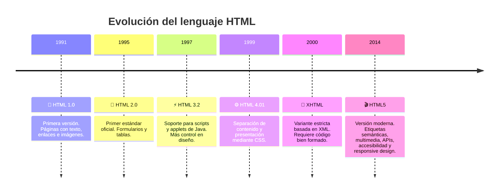

# UT1 - HTML

El **Lenguaje de Marcado de Hipertexto (HTML)** es el pilar fundamental del desarrollo web, ya que define la estructura y el contenido de las páginas en Internet. A través de etiquetas y atributos, se indica al navegador cómo debe organizar y presentar los diferentes elementos de un documento, como texto, imágenes, enlaces, formularios o contenido multimedia.

HTML no es un lenguaje de programación, sino un **lenguaje de marcas**. Esto significa que su función principal es describir la información y la manera en que esta se muestra, sin aportar lógica de ejecución. Cada versión de HTML ha ido evolucionando para adaptarse a las nuevas necesidades de la web, siendo **HTML5** el estándar actual, que incluye mejoras en semántica, accesibilidad y soporte para contenido multimedia.

En esta unidad se busca comprender la importancia de HTML como base de los sitios web, aprender su sintaxis y estructura, y conocer las principales etiquetas que permiten crear documentos correctamente organizados, accesibles y compatibles con distintos navegadores y dispositivos.

  

---
## **¿Qué es HTML?**

El **HTML (HyperText Markup Language)** es el lenguaje estándar utilizado para crear y estructurar páginas web.  
Su función es describir el contenido de un documento mediante un sistema de **etiquetas** que indican al navegador cómo debe mostrarse cada parte de la información.

A diferencia de otros lenguajes de programación, **HTML no ejecuta instrucciones ni cálculos**, sino que se limita a **estructurar y presentar contenido**. Entre los elementos que se pueden representar con HTML se encuentran:

- **Texto** (párrafos, títulos, citas, etc.)
- **Enlaces** a otras páginas o secciones del mismo documento.
- **Imágenes** y otros recursos multimedia.
- **Formularios** que permiten la interacción con el usuario.
- **Tablas** para organizar datos.
- **Bloques de contenido** con distintos niveles de jerarquía.

:::info HTML es el **esqueleto de cualquier página web**.  
Sobre esta base se añaden otros lenguajes complementarios:
- **CSS (Cascading Style Sheets):** encargado de la presentación y el diseño.
- **JavaScript:** encargado de la interactividad y el dinamismo de la página.

De esta manera, HTML se convierte en la pieza inicial imprescindible para cualquier desarrollo web.
::: 
---

## **Evolución del lenguaje HTML**

Desde su creación a principios de los años 90 por **Tim Berners-Lee**, HTML ha pasado por distintas versiones, cada una orientada a mejorar la forma en que se estructuran y muestran los contenidos en la web.

#### Evolución del lenguaje HTML (Línea de tiempo)

:::tip Importancia de HTML5
La llegada de **HTML5** supuso un antes y un después en el desarrollo web.  
Permite crear aplicaciones mucho más completas sin necesidad de complementos externos (como Flash o Java Applets), facilita el **Responsive Design** y potencia la creación de páginas **accesibles y semánticas**.
:::
---
